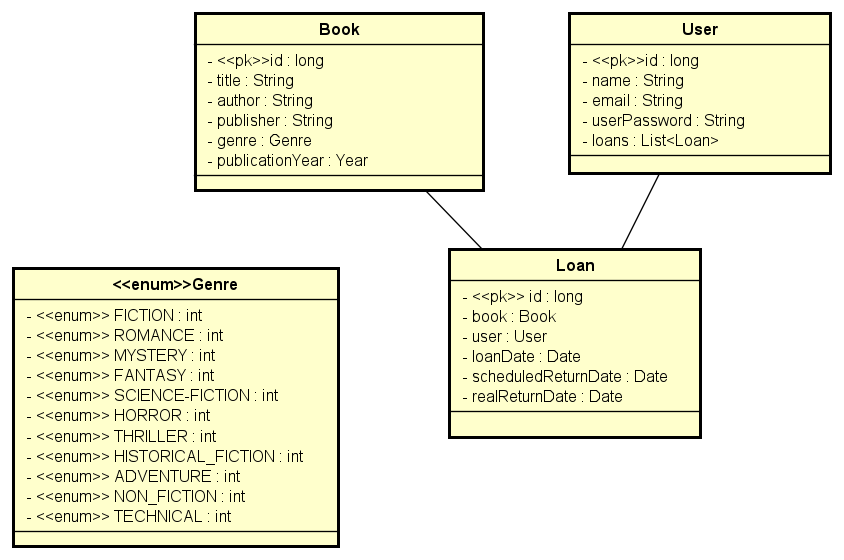

# online-library
Online Library API with Java Spring Boot

## Table of Contents
- [Overview](#overview)
- [Features](#features)
- [Technologies Used](#technologies-used)
- [Technical Implementation](#technical-implementation)
- [Usage](#usage)
- [Dependencies](#dependencies)
- [Contributing](#contributing)
- [License](#license)

## Overview

The Online Library API is a Java Spring Boot application designed to manage books, users, and loans in an online library system. It provides endpoints to perform CRUD operations on books, users, and loans, allowing users to browse books, borrow books, and return them. The application is built using modern Java technologies and follows RESTful principles for easy integration with client applications.

## Features

- **User Management**: Allows adding, updating, and deleting users from the database. Users can register with the system, update their information, and delete their accounts if needed.

- **Book Management**: Provides CRUD (Create, Read, Update, Delete) operations for managing books in the library. Users can add new books to the collection, update book details such as title, author, and genre, and delete books that are no longer in circulation.

- **Search Functionality**: Enables users to search for books based on various criteria such as title, author, or genre. This feature helps users find specific books quickly and efficiently.

- **Loan System**: Facilitates the borrowing process by allowing users to borrow books from the library. Users can view a list of available books, borrow them for a specific duration, and return them once they are done.

- **Authentication and Authorization**: Implements authentication and authorization mechanisms to ensure secure access to the API. Only authenticated users can perform certain actions such as adding or deleting books, while others may be restricted to read-only access.


## Technologies Used

- Java 17
- Maven
- Spring Boot 
- PostgreSQL
- Postman (for testing)


## Technical Implementation


### Entities

This UML diagram illustrates the structure and relationships between the entities within the Online Library project.




### Business Rules

Managing loans in the Online Library API follows specific rules to ensure a smooth borrowing experience for users:

- **Single Borrowing**: Each user can only borrow one book at a time, preventing overloading and ensuring fair access to resources.

- **Return Deadline**: Users have a grace period of 7 calendar days from the loan date to return the borrowed book.

- **Renewal Option**: After the initial 7-day period, users can renew their loan for an additional 7 days. 

- **Suspension Policy**: If a user exceeds the return deadline, they receive a temporary suspension from borrowing books for 15 days after returning the overdue book. 


## Usage


### Database Configuration:

- Ensure that PostgreSQL is installed on your system.
- Create a new database for the Online Library API.
- Open the `application.properties` file in the `src/main/resources` directory.
- Update the database connection details:

```
spring.datasource.url=jdbc:postgresql://localhost:5432/your_database_name
spring.datasource.username=your_username
spring.datasource.password=your_password
spring.jpa.hibernate.ddl-auto=update
```

### Making Requests

Base URL for each request is `https://localhost:8080/library`, so combine it with one of the following parts.

#### User

Endpoints for managing users, including user registration, authentication, and updating user information.

| Link          | HTTP Method   | Description                                        | 
| ------------- | ------------- | -------------------------------------------------  |
| `/user/login`      | POST          | Authenticate user.                      |
| `/user/register`      | POST          | Add new user to the database.                      |
| `/user/update` | PUT           | Update specific user's fields.           |
| `/user/{id}` | DELETE        | Delete from the database user with provided `{id}`. |
| `/user/{id}/loans` | GET        | Retrieve the loans associated with a specific user identified by their `{id}`. |


#### Book

Endpoints for managing books, including CRUD operations and filtering by title, author, and genre.

| Link          | HTTP Method   | Description                                        | 
| ------------- | ------------- | -------------------------------------------------  |
| `/books`      | GET           | Retrieve the list of all books.                    |
| `/books?title={title}`      | GET           | Retrieve book by title.                            |
| `/books?author={author}`      | GET           | Retrieve book by author.                           |
| `/books?genre={genre}`      | GET           | Retrieve book by genre.    	                |
| `/books`      | POST          | Add new book to the database.   	                |
| `/books/{id}` | DELETE        | Delete book from the database with provided `{id}`.|


#### Loan

Endpoints for managing loans, including borrowing and returning books, and checking loan authorization.

| Link          | HTTP Method   | Description                                        | 
| ------------- | ------------- | -------------------------------------------------  |
| `/loans`      | GET           | Retrieve the list of all loans.                    |
| `/loans/{userId}`| GET         | Retrieve list of borrowed books that are assigned to the user. |
| `/loans`   | POST         | Add new loan to the database.                          |
| `/loans/return`   | PUT         | Return a loan.                      |
| `/loans/renewal`   | PUT         | Renew a loan.                      |
| `/loans/{id}`   | DELETE         | Delete loan from the database with provided `{id}`. |


## Dependencies 

The project relies on the following dependencies:

- Spring Boot Starter Web
- Spring Boot Starter Data JPA
- Spring Boot Starter Security
- PostgreSQL Driver
- Lombok


## Contributing

If you'd like to contribute to Online Library, please fork the repository, create a new branch, make your changes, and submit a pull request.

## License

This project is licensed under the [MIT License](LICENSE).
